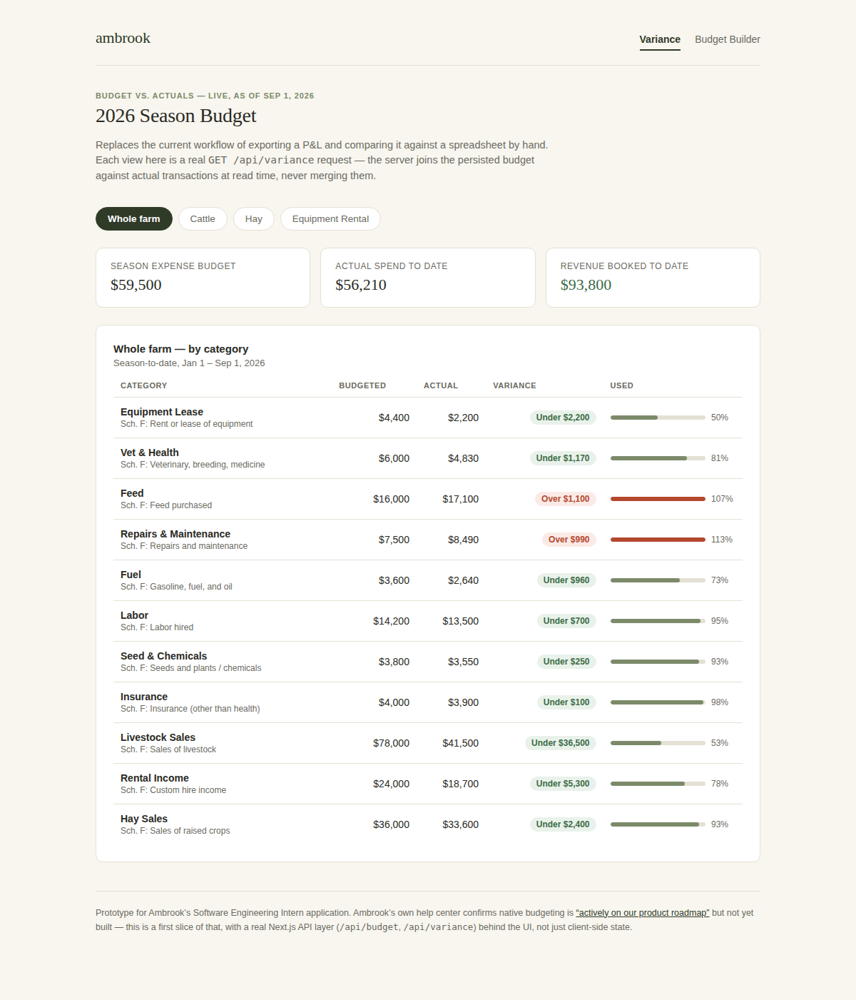

# Ambrook Budget Planner (prototype)

An unsolicited project built for Ambrook's **Software Engineering Intern** application — a native budgeting and live budget-vs-actuals prototype, full-stack (Next.js API routes + a persisted store behind the UI, not just client state), built in the same stack Ambrook uses (Next.js, React, TypeScript), aimed at a gap Ambrook has already told its own customers is coming but hasn't shipped yet — directly matching the intern JD's "build and ship full-stack product features."



## Why this, specifically

Ambrook's help center says it directly:

> "Ambrook does not currently have a built-in budgeting feature, so budgets cannot be loaded or uploaded directly into the platform." Users are told to "keep your budget entirely outside of Ambrook," export a report, and build the budget-vs-actuals comparison "in your spreadsheet." — [Tracking Budgets and Comparing Actuals in Ambrook](https://support.ambrook.com/en/articles/14707419-tracking-budgets-and-comparing-actuals-in-ambrook) (Ambrook Help Center, Apr 21 2026)

The same article adds that "native budget-vs-actuals functionality is actively on our product roadmap." Ambrook's closest analog in a market it hasn't entered — [Figured](https://www.figured.com/en-nz/planning-budgeting), the dominant farm-finance platform in NZ/AU/UK — has built much of its business around exactly this: rolling, production-linked budgets with an advisor-collaboration tier layered on top.

This prototype is a first slice of that: a **budget builder** (set a season target per category, by enterprise or for the whole farm) and a **live variance view** (budgeted vs. actual, recalculated from bookkeeping data rather than a manual monthly export). The full reasoning, UX flow, technical approach, and revenue argument is written up in [`design-plan.md`](./design-plan.md).

## What's actually built vs. what's a stand-in

This is a scoped proof of concept, not a claim of production readiness — worth being upfront about as an intern applicant:

- **Real:** the data model (`lib/types.ts`), the variance-calculation logic (`lib/variance.ts`), two Next.js API routes (`app/api/budget/route.ts`, `app/api/variance/route.ts`), a server-side persistence layer (`lib/budgetStore.ts`), the budget builder UI (`app/budget/page.tsx`), and the variance dashboard UI (`app/page.tsx`) are all working code, not mockups — the UI talks to the API over real `fetch` calls, not local state pretending to be a backend.
- **Stand-in:** the "actuals" are hand-written mock transactions (`lib/mockData.ts`) shaped like Ambrook's real chart-of-accounts and multi-enterprise model (Cattle / Hay / Equipment Rental), not a live connection to Ambrook's actual data — I don't have access to that. The persistence layer is a JSON file on disk (`data/budget.json`, created automatically, gitignored) rather than PostgreSQL — a stand-in chosen so the project needs zero database setup to run, not because the write path is fake. It's a real server-side write that survives a restart, at a real API endpoint, validated server-side.
- **Deliberate constraint carried over from the real problem:** budget data is never merged into the transaction ledger — it's joined against actuals only at read time, on the server (see the comment in `lib/variance.ts` and `app/api/variance/route.ts`). Ambrook's own help docs warn that entering hypothetical numbers directly can "impact your balances and reporting accuracy," so this prototype treats that as a hard boundary enforced by the data model, not an afterthought.

## Running it

```bash
npm install
npm run dev
```

Then open `http://localhost:3000`. Two pages: `/` (variance view) and `/budget` (budget builder) — both talk to the API routes (`/api/budget`, `/api/variance`) rather than holding their own copy of the truth. An edit on the builder page does a real `POST /api/budget`, persists to `data/budget.json` on the server, and the variance page picks up the change on its next fetch. No database install, account, or environment variables needed — the data file is created automatically on first run.

## Stack

Matched deliberately to Ambrook's own stack, as described in their engineering job postings and their "In the Weeds" engineering blog post:

- Next.js (App Router) + React + TypeScript, front end and back end (API routes) in the same framework
- No external UI library — plain CSS, styled to sit close to Ambrook's actual product (cream background, dark green primary, serif wordmark)
- Persistence: a JSON file standing in for what would be Ambrook's actual PostgreSQL data layer — the API shape (`GET`/`POST /api/budget`, `GET /api/variance`) is what would carry over to a real Postgres-backed version; only `lib/budgetStore.ts` would change

## Files

```
app/
  page.tsx              variance dashboard (home) — fetches from /api/variance
  budget/page.tsx        budget builder — fetches/writes via /api/budget
  api/budget/route.ts     GET current budget, POST an upsert (server-validated)
  api/variance/route.ts   GET computed variance for a scope
  layout.tsx             shared shell + nav
  globals.css             styling
components/
  BudgetContext.tsx      loads budget from the API, exposes updateLineItem()
  EnterpriseTabs.tsx      whole-farm / per-enterprise scope switcher
  TopBar.tsx              nav
lib/
  types.ts                data model
  mockData.ts              mock enterprises, categories, transactions, starting budget
  variance.ts              budget-vs-actual calculation (pure — runs server-side)
  budgetStore.ts           server-side persistence (JSON file, auto-seeded)
design-plan.md             full written proposal: problem, competitive context, UX flow, technical approach, edge cases, revenue argument
screenshots/               rendered screenshots of both pages
```
